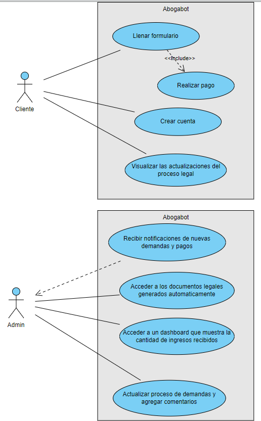
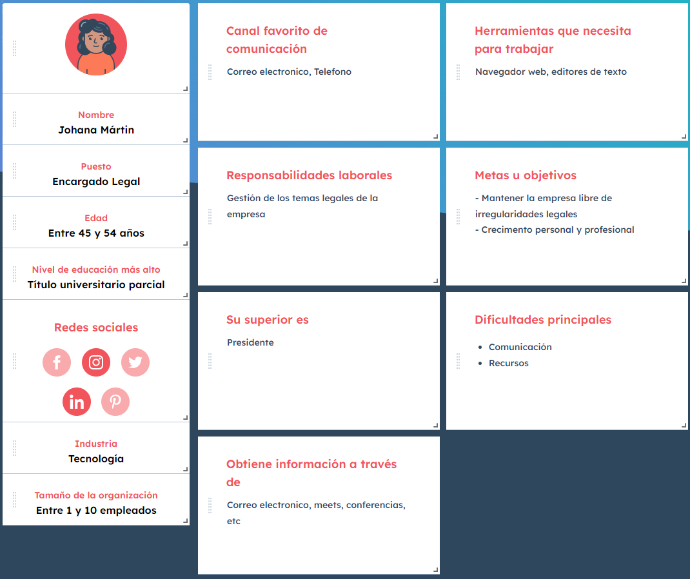
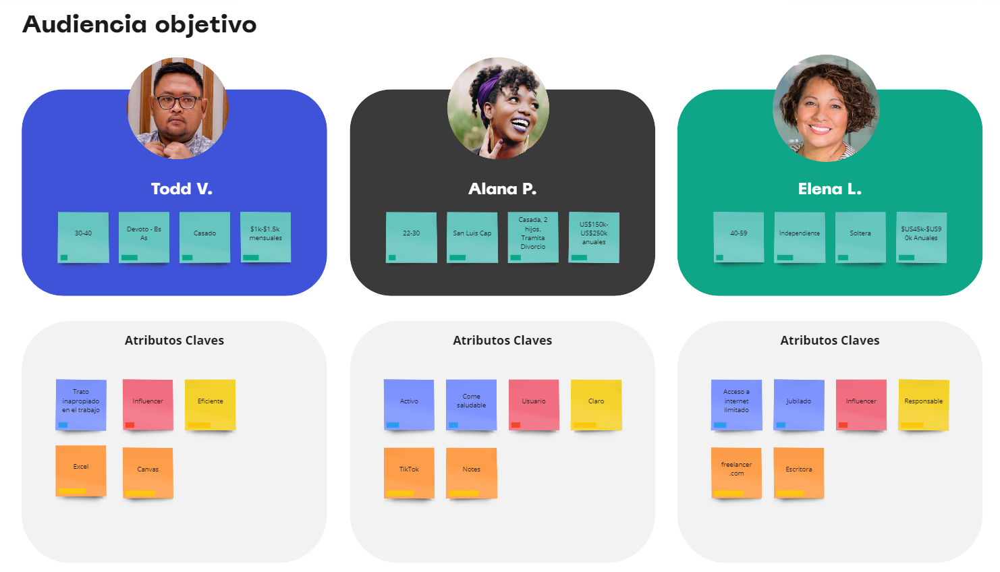

# Practica 1 - Abogabot
Se requiere automatizar las demandas de los clientes
## **Requerimientos**
### **Cliente**
Debe ser capaz de:
- Llenar un formulario en la plataforma con los datos de la demanda, luego
realizar el pago para finalizar la transacción.
- Crear una cuenta en la plataforma para realizar el seguimiento de las actualizaciones del proceso legal.
- Recibir correos con la notificación del avance de su proceso.
### **Administrador**
Debe ser capaz de:
- Recibir notificaciones de las nuevas demandas, podra acceder a un documento legal en formato docx, con el cual podra comenzar el proceso.
- Recibir los pagos realizados por los cliente y poder visualizar un dashboard con la cantidad de ingresos recibidos.
- Actualizar el proceso de la demanda y agregar comentarios en cada paso.
### **General**
- La pagina debe ser reponsive.
- Colores preferidos para Abogabot: Azul marino y blanco.

### **Diagrama**

## **Buyer Persona**

## **Publico Objetivo**

## **Wireframes**
[Wireframe Cliente](./assets/wireframe-cliente.pdf)

[Wireframe Administrador](./assets/wireframe-admin.pdf)